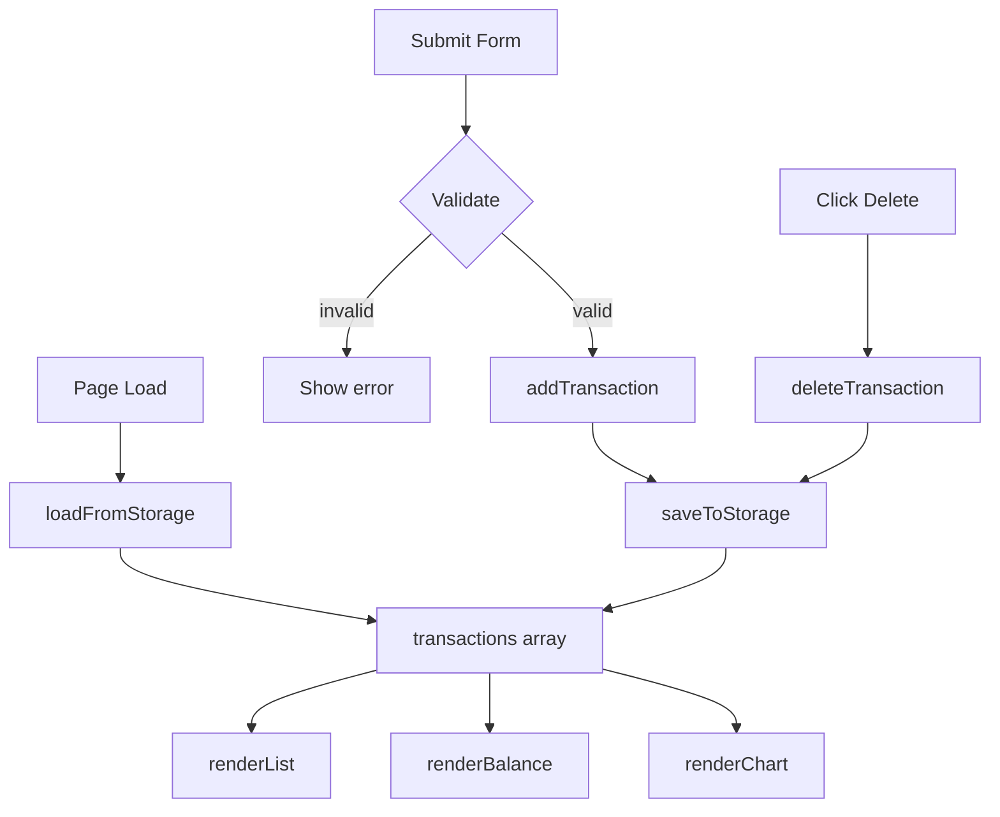

# Design Document: Expense & Budget Visualizer

## Overview

A mobile-friendly, single-page Expense & Budget Visualizer that runs entirely in the browser with no backend. The user can add expense transactions (name, amount, category), view them in a scrollable list, delete individual entries, see a live total balance, and visualize spending by category in a pie chart. All data is persisted in `localStorage` as JSON so it survives page refreshes.

The layout is responsive and works on phones — adapting to viewport widths as small as 320px with a single-column stacked layout on small screens and a centered max-width container on larger ones.

The app is intentionally minimal: one HTML file, one CSS file (`css/style.css`), one JavaScript file (`js/app.js`), and Chart.js loaded from a CDN. No build tools, no frameworks, no server.

---

## Architecture

The app follows a simple **state → render** cycle:

```
User Action
    │
    ▼
js/app.js  ──► mutate in-memory state (transactions[])
    │
    ├──► persist to localStorage (JSON.stringify)
    │
    └──► re-render UI
              ├── renderList()      → transaction list DOM
              ├── renderBalance()   → total balance display
              └── renderChart()     → Chart.js pie chart
```

There is no virtual DOM, no reactive framework, and no module bundler. All logic lives in a single IIFE (or top-level script) inside `js/app.js`. The render functions are pure in the sense that they always rebuild their output from the current `transactions` array.

The CSS uses responsive layout techniques (flexbox/grid with a max-width container) to support mobile viewports down to 320px.



---

## Components and Interfaces

### HTML Structure (`index.html`)

| Element | Role |
|---|---|
| `#balance` | Displays the current total balance |
| `#expense-form` | Input form (name, amount, category, submit button) |
| `#error-msg` | Inline validation / storage error message |
| `#transaction-list` | `<ul>` rendered with one `<li>` per transaction |
| `#chart-canvas` | `<canvas>` element passed to Chart.js |

> Note: `index.html` must include `<meta name="viewport" content="width=device-width, initial-scale=1">` for correct mobile rendering.

### Responsive Layout

The CSS implements a mobile-first responsive layout:

- **Single-column stacked layout on mobile (≤480px)**: sections appear in order — balance → form → list → chart.
- **Max-width container (480px) centered on larger screens**: the app column is capped at 480px and centered with `margin: 0 auto`.
- **Touch targets**: all interactive elements (buttons, inputs, select) have a minimum height of 44px to meet touch target requirements (Requirement 7.8).
- **Font size**: minimum 14px for all body text (Requirement 7.6).
- **No horizontal scrolling**: layout does not overflow at 320px viewport width (Requirement 7.9).

### JavaScript Functions (`js/app.js`)

| Function | Signature | Responsibility |
|---|---|---|
| `loadFromStorage()` | `() → Transaction[]` | Reads and parses `localStorage`, returns array (empty on failure) |
| `saveToStorage(txns)` | `(Transaction[]) → void` | Serializes array to JSON and writes to `localStorage`; shows error on failure |
| `addTransaction(name, amount, category)` | `(string, number, string) → void` | Creates a new Transaction, pushes to array, saves, re-renders |
| `deleteTransaction(id)` | `(string) → void` | Filters transaction out of array, saves, re-renders |
| `renderList()` | `() → void` | Clears and rebuilds `#transaction-list` from `transactions` |
| `renderBalance()` | `() → void` | Sums all amounts and updates `#balance` text |
| `renderChart()` | `() → void` | Aggregates amounts by category, updates or creates Chart.js instance |
| `validateForm(name, amount, category)` | `(string, string, string) → string\|null` | Returns an error message string or `null` if valid |
| `handleSubmit(event)` | `(Event) → void` | Form submit handler — validates, calls `addTransaction`, clears form |

### Chart.js Integration

A single `Chart` instance is kept in a module-level variable (`let chartInstance`). On each `renderChart()` call:
- If `chartInstance` exists, call `chartInstance.destroy()` before creating a new one (avoids canvas reuse warnings).
- Categories with zero total are excluded from the dataset.

---

## Data Models

### Transaction

```js
{
  id: string,        // crypto.randomUUID() or Date.now().toString()
  name: string,      // item name, non-empty
  amount: number,    // positive float, e.g. 12.50
  category: string   // one of: "Food" | "Transport" | "Fun"
}
```

### Storage Schema

Key: `"expense-tracker-transactions"`  
Value: JSON-serialized `Transaction[]`

```json
[
  { "id": "1700000000000", "name": "Lunch", "amount": 12.5, "category": "Food" },
  { "id": "1700000000001", "name": "Bus pass", "amount": 30, "category": "Transport" }
]
```

On load, the value is parsed with `JSON.parse`. If the key is absent or parsing throws, the app starts with an empty array.

### Category Totals (derived, not stored)

```js
{
  Food: number,
  Transport: number,
  Fun: number
}
```

Computed on every `renderChart()` call by reducing the `transactions` array.


---

## Correctness Properties

*A property is a characteristic or behavior that should hold true across all valid executions of a system — essentially, a formal statement about what the system should do. Properties serve as the bridge between human-readable specifications and machine-verifiable correctness guarantees.*

### Property 1: Invalid form submissions are rejected

*For any* combination of form inputs where at least one field is empty or invalid (empty name, non-positive amount, or missing category), submitting the form should not add any transaction to the list or to storage, and the transaction count should remain unchanged.

**Validates: Requirements 1.3**

---

### Property 2: Transaction add round-trip

*For any* valid transaction (non-empty name, positive amount, valid category), after it is added via the form, it should appear in the rendered transaction list and be retrievable from `localStorage` with the same name, amount, and category.

**Validates: Requirements 1.2, 5.2**

---

### Property 3: Form is cleared after successful add

*For any* valid transaction submission, after the transaction is added, all form fields (name, amount, category) should be reset to their default/empty state.

**Validates: Requirements 1.4**

---

### Property 4: List renders all transaction data

*For any* set of transactions in the app state, every transaction's name, amount, and category should appear in the rendered transaction list, and no extra transactions should be present.

**Validates: Requirements 2.1**

---

### Property 5: List is ordered most-recent-first

*For any* sequence of transactions added in order, the rendered list should display them in reverse insertion order (most recently added at the top).

**Validates: Requirements 2.2**

---

### Property 6: Delete round-trip

*For any* transaction currently in the list, after the user deletes it, that transaction should no longer appear in the rendered list and should no longer be present in `localStorage`.

**Validates: Requirements 2.3, 5.2**

---

### Property 7: Balance equals sum of all amounts

*For any* set of transactions, the displayed balance should equal the arithmetic sum of all transaction amounts. This must hold after every add and every delete without a page reload.

**Validates: Requirements 3.1, 3.2, 3.3**

---

### Property 8: Chart data matches category totals

*For any* set of transactions, the data values in the pie chart should equal the per-category sums of transaction amounts, and any category with a zero total should be omitted from the chart dataset.

**Validates: Requirements 4.1, 4.2, 4.3, 4.4**

---

### Property 9: Storage persistence round-trip

*For any* set of transactions written to `localStorage`, re-initializing the app (simulating a page reload by calling the load function) should produce a transaction array that is deeply equal to the original, and the rendered list, balance, and chart should reflect that restored data.

**Validates: Requirements 5.1, 5.2**

---

## Error Handling

| Scenario | Detection | Response |
|---|---|---|
| Form submitted with empty name | `name.trim() === ""` | Show error in `#error-msg`, abort save |
| Form submitted with non-positive amount | `isNaN(amount) \|\| amount <= 0` | Show error in `#error-msg`, abort save |
| Form submitted with no category selected | `category === ""` | Show error in `#error-msg`, abort save |
| `localStorage.setItem` throws (quota exceeded, private mode) | `try/catch` around write | Show storage error in `#error-msg` |
| `localStorage.getItem` returns null or unparseable JSON | `try/catch` around `JSON.parse` | Start with empty array, no error shown (silent recovery) |
| Chart.js CDN fails to load | `window.Chart === undefined` check before `renderChart()` | Log warning to console; chart canvas remains blank |

Error messages are displayed in a single `#error-msg` element. The element is cleared on each new valid submission and hidden when empty.

---

## Testing Strategy

Because the technical constraints prohibit a test setup (Requirement 6.5), automated tests cannot be wired into the project's file structure. The testing strategy below describes how the correctness properties and unit tests *would* be implemented if a test harness were added, and serves as a specification for manual verification and future test adoption.

### Unit Tests (example-based)

Focus on specific examples, integration points, and error conditions:

- Form renders with correct fields and category options (Requirement 1.1)
- Submitting a fully valid form adds exactly one item to the list
- Submitting with each field individually empty shows an error and adds nothing
- Deleting the only transaction leaves an empty list and zero balance
- `loadFromStorage()` returns `[]` when the key is absent
- `loadFromStorage()` returns `[]` when the stored value is malformed JSON
- Storage write failure triggers the error message (mock `localStorage.setItem` to throw)
- Chart omits a category segment when that category has no transactions (edge case for Property 8)
- Storage unavailable error message is displayed (edge case for Requirement 5.3)

### Property-Based Tests

Each property maps to a single property-based test. Recommended library: **fast-check** (JavaScript).  
Minimum 100 iterations per property. Each test must be tagged with the format:

`// Feature: browser-local-storage-app, Property N: <property text>`

| Test | Property | Generator inputs |
|---|---|---|
| Invalid inputs are rejected | Property 1 | Random combinations of blank/invalid field values |
| Add round-trip | Property 2 | Random valid `{name, amount, category}` tuples |
| Form cleared after add | Property 3 | Random valid `{name, amount, category}` tuples |
| List renders all data | Property 4 | Random arrays of valid transactions |
| List is most-recent-first | Property 5 | Random ordered sequences of transactions |
| Delete round-trip | Property 6 | Random transaction arrays, random index to delete |
| Balance equals sum | Property 7 | Random transaction arrays (add and delete sequences) |
| Chart matches category totals | Property 8 | Random transaction arrays with varied category distributions |
| Storage persistence round-trip | Property 9 | Random transaction arrays serialized then deserialized |

### Manual Verification Checklist

Since no test runner is configured, the following manual checks cover the acceptance criteria:

1. Open `index.html` in Chrome, Firefox, Edge, and Safari — app loads without errors.
2. Add a transaction → appears at top of list, balance updates, chart updates.
3. Add transactions in multiple categories → chart shows correct proportions.
4. Delete a transaction → removed from list, balance and chart update.
5. Refresh the page → all transactions are restored from localStorage.
6. Submit form with empty name → error shown, no transaction added.
7. Submit form with amount = 0 or negative → error shown.
8. Submit form with no category selected → error shown.
9. Add a transaction in only one category → chart shows single segment.
10. Delete all transactions → balance shows 0, chart is empty.
11. Open `index.html` on a mobile device or with browser DevTools set to 375px width — layout stacks correctly with no horizontal scroll.
12. Tap form controls and delete buttons on a touch device — all targets are large enough to tap without zooming.
